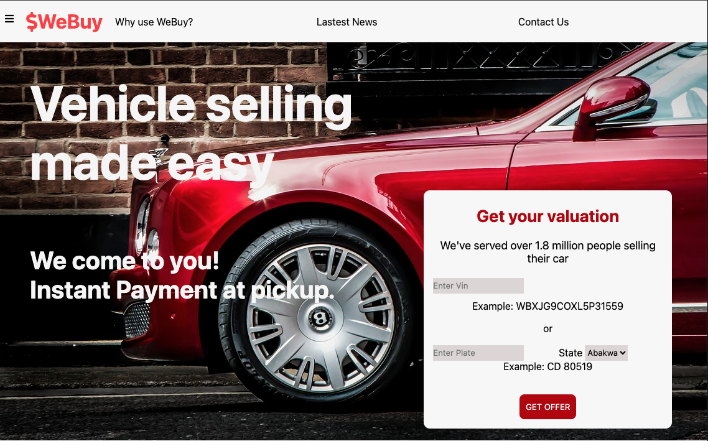
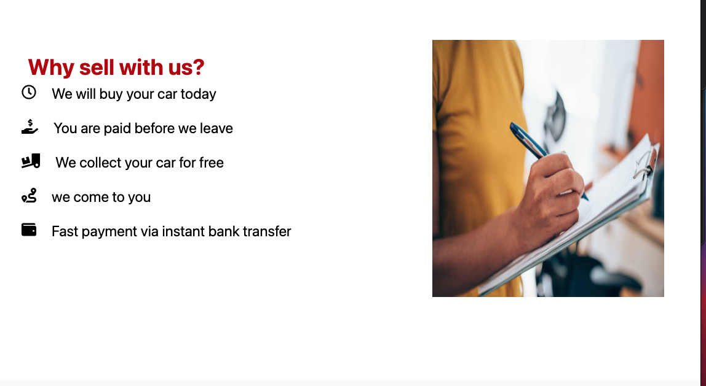
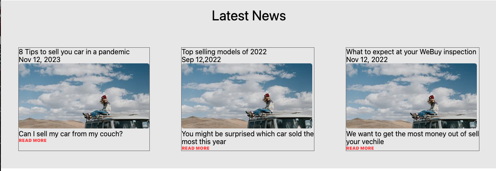

# WEBUY

Project Description

## App Home page

> This is the bueatiful front view of the app strickly reponsive on desktop with min width of 786px having a section of every car valuation details from all client that visits the site.

## Why sell with us

 > This section is actually building some pychological confidence with the client making them to see reasons why they should do business with us.

## Latest News

>This section gives client the trending news, some selling tips and some models the site has been able to trade proviously. 

## Contact Us

>In this section are list of our contacts and social media links where customers get in touch with us and get to see some frequently asked questions and answers to these questions

## About this App
 This is an app built for car retails whereby customers or its users can access and sell or buy their cars irrespective of the state of the car.

## Built with
- HTML
- CSS

### Prerequisites
  Knowledge about CSS styles & HTML tags
- section
- Flex
- Grid

## Start App
Click this link

## Author
. GitHub: [@buhills](https://github.com/buhills)
. Twitter: [@hills_nfor](https://twitter.com/hills_nfor)
. Linkedln: [@hills_nfor](https://linkedln.com/hills_nfor)
