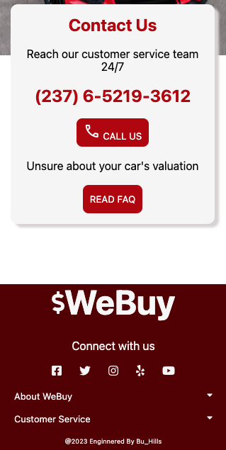

# WEBUY

Project Description

## App Home page

> This is the bueatiful front view of the app strickly reponsive on mobile with max with of 786px.

## Car Valuation

 > We evaluate the value and the price of the car base on some of the details provided by the customer or users usally the **Car VIN** or **Car Plate No:**.

## Contact Us

>In this section are list of our contacts and social media links where constomers get in touch with us

## About this App
 This is a mobile responsive app built for car retails whereby customers or its users can access and sell or buy their cars irrespective of its states.

## Built with
- HTML
- CSS

### Prerequisites
    Knowledge about CSS styles & HTML tags
- section 
- Flex
- Grid

## Start App
Click this link

## Author
. GitHub: [@buhills](https://github.com/buhills)
. Twitter: [@hills_nfor](https://twitter.com/hills_nfor)
. Linkedln: [@hills_nfor](https://linkedln.com/hills_nfor)
